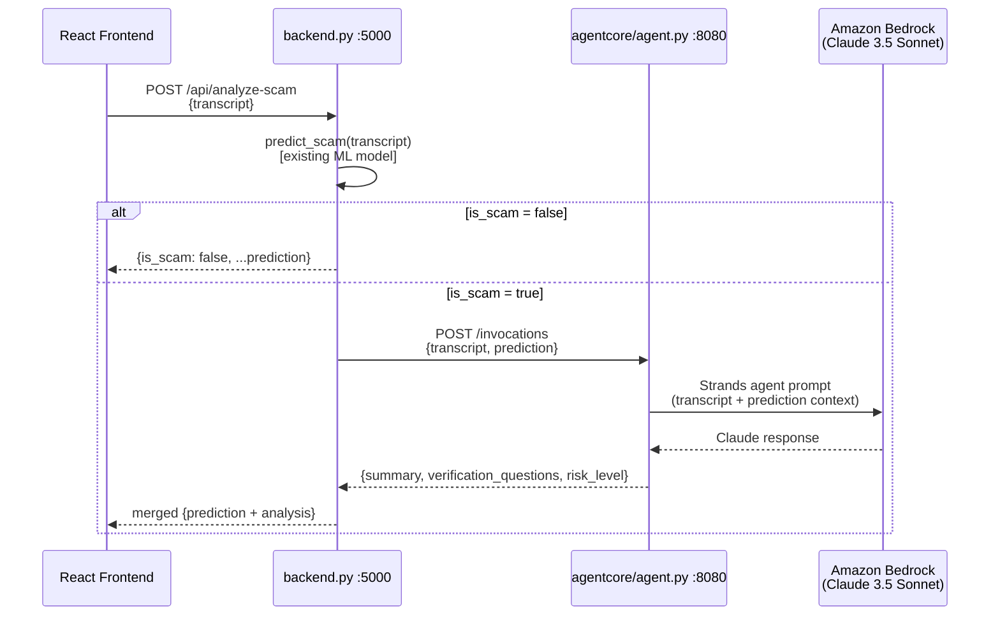
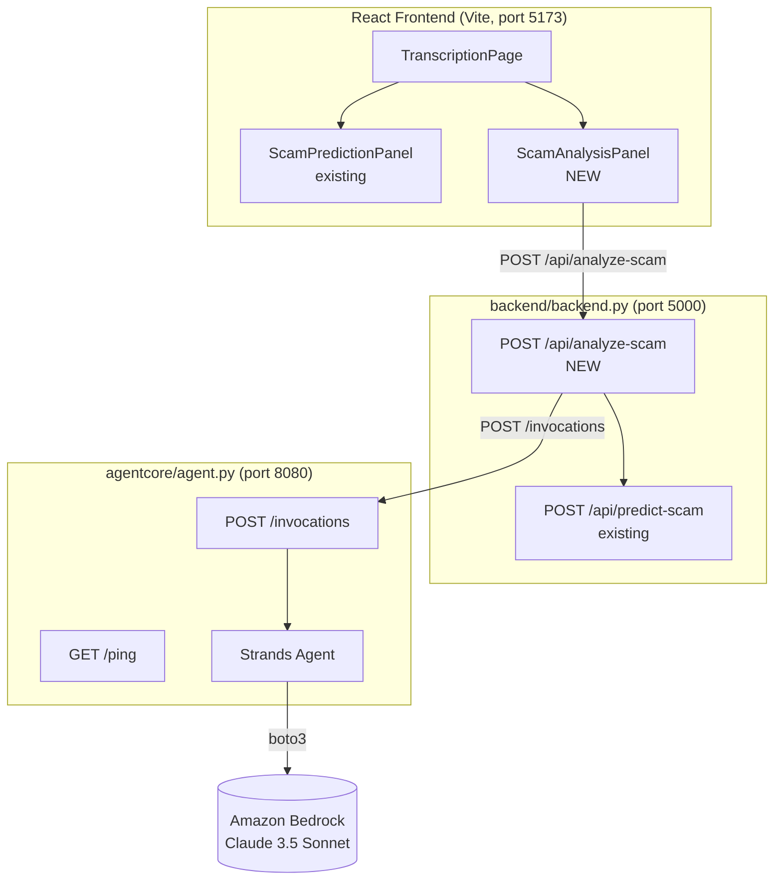

# Design Document: Bedrock AgentCore Scam Analysis

## Overview

This feature adds a second layer of scam analysis to VoiceShield by connecting an Amazon Bedrock-powered AI agent whenever the ML classifier flags an incoming call. The system is composed of three layers:

1. **AgentCore Service** (`agentcore/agent.py`, port 8080) — a FastAPI app that wraps a Strands agent and Claude 3.5 Sonnet on Amazon Bedrock. It accepts the rolling transcript and ML prediction result and returns a structured `Analysis_Response`.
2. **Prediction Proxy** (new route on `backend/backend.py`, port 5000) — orchestrates the two-step flow: ML prediction first, then AgentCore analysis if the call is flagged. Keeps all AWS credentials server-side.
3. **ScamAnalysisPanel** (new React component) — displays the LLM summary and verification questions in the existing `TranscriptionPage` layout when a scam is detected.

During local development the AgentCore Service runs as a plain Python process or a local Docker container. The `deploy.py` script handles ECR push and AgentCore Runtime registration for production.

---

## Architecture





---

## Components and Interfaces

### AgentCore Service (`agentcore/agent.py`)

**Endpoints:**

#### `GET /ping`
```
Response 200:
{
  "status": "healthy"
}
```

#### `POST /invocations`

Request:
```json
{
  "transcript": "<rolling transcript string, 1–5000 characters>",
  "prediction": {
    "is_scam": true,
    "scam_probability": 0.92,
    "safe_probability": 0.08,
    "confidence_level": "HIGH",
    "triggers_detected": ["urgent payment request", "legal threat"]
  }
}
```

Response 200:
```json
{
  "summary": "<≤300 word explanation of why the call was flagged, citing specific phrases and trigger names>",
  "verification_questions": [
    "Can you provide your employee ID and the department you're calling from?",
    "What is your company's GST registration number?",
    "..."
  ],
  "risk_level": "CRITICAL"
}
```

Error responses:
- `415` — Content-Type is not `application/json`
- `422` — Missing required field(s); body: `{"detail": [{"loc": [...], "msg": "..."}]}`
- `400` — `scam_probability` outside `[0.0, 1.0]` or not a number; body: `{"detail": "scam_probability must be a float in [0.0, 1.0]"}`
- `503` — Bedrock invocation failed after all retries; body: `{"error": "<message>"}`

**Startup validation:**

On startup the service checks for these four environment variables: `AWS_ACCESS_KEY_ID`, `AWS_SECRET_ACCESS_KEY`, `AWS_REGION`, `BEDROCK_MODEL_ID`. If any are missing or empty the service logs the missing variable name and exits with status code 1.

---

### Prediction Proxy (`backend/backend.py`, new route)

#### `POST /api/analyze-scam`

Request:
```json
{
  "transcript": "<rolling transcript, 1–10000 characters>"
}
```

Successful response when `is_scam = false`:
```json
{
  "is_scam": false,
  "scam_probability": 0.12,
  "safe_probability": 0.88,
  "confidence_level": "HIGH",
  "triggers_detected": []
}
```

Successful response when `is_scam = true` and AgentCore returns normally:
```json
{
  "is_scam": true,
  "scam_probability": 0.92,
  "safe_probability": 0.08,
  "confidence_level": "HIGH",
  "triggers_detected": ["urgent payment request"],
  "summary": "...",
  "verification_questions": ["...", "..."],
  "risk_level": "CRITICAL"
}
```

Graceful degradation (AgentCore unreachable / timeout / non-2xx):
```json
{
  "is_scam": true,
  "scam_probability": 0.92,
  "safe_probability": 0.08,
  "confidence_level": "HIGH",
  "triggers_detected": ["urgent payment request"],
  "analysis_error": "AgentCore service unavailable: connection refused"
}
```

Error responses:
- `400` — `transcript` missing or empty/whitespace

**Startup validation:**

On startup the proxy reads `AGENTCORE_INVOCATION_URL` from environment. If missing or empty it logs the missing variable and exits with status code 1.

---

### Frontend: `ScamAnalysisPanel`

Props interface:
```typescript
interface ScamAnalysisResult {
  is_scam: boolean
  scam_probability: number
  safe_probability: number
  confidence_level: 'HIGH' | 'MEDIUM' | 'LOW'
  triggers_detected: string[]
  // present when is_scam=true and AgentCore succeeded
  summary?: string
  verification_questions?: string[]
  risk_level?: 'CRITICAL' | 'HIGH' | 'MEDIUM' | 'LOW'
  // present when AgentCore failed
  analysis_error?: string
}

interface ScamAnalysisPanelProps {
  transcript: string
  isVisible?: boolean
}
```

Internal state:
```typescript
const [result, setResult] = useState<ScamAnalysisResult | null>(null)
const [isLoading, setIsLoading] = useState(false)
const [error, setError] = useState<string | null>(null)
const abortControllerRef = useRef<AbortController | null>(null)
```

---

## Data Models

### Pydantic models — AgentCore Service

```python
from pydantic import BaseModel, Field, field_validator
from typing import List

class PredictionInput(BaseModel):
    is_scam: bool
    scam_probability: float = Field(..., ge=0.0, le=1.0)
    safe_probability: float
    confidence_level: str
    triggers_detected: List[str]

class InvocationRequest(BaseModel):
    transcript: str = Field(..., min_length=1)
    prediction: PredictionInput

class AnalysisResponse(BaseModel):
    summary: str
    verification_questions: List[str]
    risk_level: str  # CRITICAL | HIGH | MEDIUM | LOW
```

### Pydantic models — Backend Prediction Proxy

```python
class AnalyzeScamRequest(BaseModel):
    transcript: str = Field(..., min_length=1, max_length=10000)

class AnalyzeScamResponse(BaseModel):
    is_scam: bool
    scam_probability: float
    safe_probability: float
    confidence_level: str
    triggers_detected: List[str]
    # Optional fields present when AgentCore is invoked
    summary: Optional[str] = None
    verification_questions: Optional[List[str]] = None
    risk_level: Optional[str] = None
    analysis_error: Optional[str] = None
```

### Risk Level Thresholds

| scam_probability | risk_level |
|---|---|
| ≥ 0.85 | `CRITICAL` |
| ≥ 0.60 | `HIGH` |
| ≥ 0.35 | `MEDIUM` |
| < 0.35 | `LOW` |

---

## Strands Agent Prompt Template

The agent receives a structured prompt that embeds both the ML context and the raw transcript. The prompt is constructed in `agentcore/agent.py` and passed to the Strands `Agent` as the user message:

```
You are a scam-call analysis expert assistant embedded in VoiceShield, a real-time call protection system.

An ML classifier has flagged this call with the following result:
- Scam probability: {scam_probability:.1%}
- Confidence level: {confidence_level}
- Trigger patterns detected: {triggers_list}

Here is the verbatim transcript of the call so far:
---
{transcript}
---

Your task:
1. Write a SUMMARY (maximum 300 words) explaining WHY this call was flagged. Reference specific phrases from the transcript and name the trigger patterns that matched. Be specific and factual.
2. Write 3 to 7 VERIFICATION QUESTIONS that the call recipient can ask to determine whether the caller is legitimate. Questions should probe for verifiable information the caller should know if genuine (e.g., employee ID, company registration number, department, case reference number, GST number, originating office address).

Respond ONLY with valid JSON in this exact format (no markdown, no code fences):
{{
  "summary": "<your summary here>",
  "verification_questions": [
    "<question 1>",
    "<question 2>",
    ...
  ]
}}
```

The `risk_level` field is **not** computed by the LLM — it is derived deterministically in Python from `scam_probability` before the response is returned:

```python
def compute_risk_level(scam_probability: float) -> str:
    if scam_probability >= 0.85:
        return "CRITICAL"
    elif scam_probability >= 0.60:
        return "HIGH"
    elif scam_probability >= 0.35:
        return "MEDIUM"
    else:
        return "LOW"
```

---

## Rolling Transcript Accumulation

The `useTranscription` hook already accumulates `TranscriptionSegment` objects in its `segments` state. Each segment has a `transcript` string field (the final, non-partial text for that utterance).

`TranscriptionPage` computes `fullTranscript` via `useMemo` over `segments`. Currently it uses `seg.alternatives?.[0]?.transcript` which does not match the actual segment shape (segments have a top-level `transcript` string, not an `alternatives` array). This will be fixed as part of this implementation.

Corrected accumulation:
```typescript
const fullTranscript = useMemo(() => {
  const segmentText = segments
    .map((seg) => seg.transcript)   // direct field, not alternatives
    .filter(Boolean)
    .join(' ')
  return segmentText.trim()
}, [segments])
```

`ScamAnalysisPanel` receives this `fullTranscript` prop and fires a `POST /api/analyze-scam` call (debounced 800 ms) whenever it changes and is non-empty.

---

## Component State Management — ScamAnalysisPanel

```
Transcript prop changes
        │
        ▼
   debounce 800ms
        │
        ▼
  abort previous request (AbortController)
        │
        ▼
   setIsLoading(true)
        │
        ▼
   fetch POST /api/analyze-scam  ──── timeout 30s ────► cancel + setError("timeout")
        │
   ┌────┴────┐
  ok        error
   │            │
   ▼            ▼
setResult   setError(msg)
setIsLoading(false)
```

Key rules:
- Each new transcript debounce cancels any in-flight request via `AbortController`.
- When `transcript` becomes empty the component resets all state.
- The 30-second timeout is implemented by passing a `signal` from `AbortController` to `fetch` and using `setTimeout` to call `abort()`.
- When `is_scam` is `false` in the result, the panel does not render the analysis section (summary + questions) — it renders nothing (the existing `ScamPredictionPanel` handles that case).

---

## Retry Logic (AgentCore Service)

The AgentCore service uses exponential back-off when Bedrock returns a throttling (`ThrottlingException`) or service error (`ServiceUnavailableException`):

```python
import asyncio

MAX_RETRIES = 3
INITIAL_BACKOFF = 1.0  # seconds

async def invoke_with_retry(agent, prompt: str) -> str:
    delay = INITIAL_BACKOFF
    last_error = None
    for attempt in range(MAX_RETRIES + 1):
        try:
            return agent(prompt)
        except ThrottlingException as e:
            last_error = e
        except ServiceUnavailableException as e:
            last_error = e
        if attempt < MAX_RETRIES:
            await asyncio.sleep(delay)
            delay *= 2   # 1s → 2s → 4s
    raise last_error
```

Total wait before giving up: 1 + 2 + 4 = 7 seconds of back-off across 3 retry attempts (4 total invocations).

---

## File Structure

```
agentcore/
  agent.py           # FastAPI app, port 8080, Strands agent wrapper
  Dockerfile         # --platform=linux/arm64, Python 3.12-slim, uvicorn entrypoint
  requirements.txt   # pinned versions: fastapi, uvicorn, strands-agents, boto3, pydantic
  .env.example       # placeholder env vars, no real secrets
  deploy.py          # build → ECR auth → push → AgentCore Runtime create/update
  test_agent.py      # local test script, sends sample payload to /invocations

backend/
  backend.py         # + POST /api/analyze-scam route, + httpx dependency

frontend/src/
  components/
    ScamAnalysisPanel.tsx   # NEW
    TranscriptionPage.tsx   # updated: add ScamAnalysisPanel, fix fullTranscript
  styles/
    ScamAnalysisPanel.css   # NEW
  types/
    index.ts                # + ScamAnalysisResult type
```

---

## Correctness Properties

*A property is a characteristic or behavior that should hold true across all valid executions of a system — essentially, a formal statement about what the system should do. Properties serve as the bridge between human-readable specifications and machine-verifiable correctness guarantees.*

### Property 1: Risk level is a pure function of scam_probability

*For any* `scam_probability` value `p` in `[0.0, 1.0]`, `compute_risk_level(p)` must return `"CRITICAL"` if `p ≥ 0.85`, `"HIGH"` if `p ≥ 0.60`, `"MEDIUM"` if `p ≥ 0.35`, and `"LOW"` otherwise. No other value is ever returned.

**Validates: Requirements 2.4**

---

### Property 2: Invalid scam_probability is rejected before Bedrock is invoked

*For any* `scam_probability` value outside `[0.0, 1.0]` (or non-numeric), the AgentCore `/invocations` endpoint returns HTTP 400 and the Bedrock client is never called.

**Validates: Requirements 2.8**

---

### Property 3: Non-JSON Content-Type always yields 415

*For any* request to `POST /invocations` whose `Content-Type` header is not `"application/json"`, the response status is 415.

**Validates: Requirements 1.2**

---

### Property 4: Missing required fields yield 422 with named fields

*For any* combination of missing `transcript` and/or `prediction` fields in the `POST /invocations` request body, the response is 422 and the `detail` array contains an entry for each missing field by name.

**Validates: Requirements 1.3**

---

### Property 5: Merged response contains all prediction and analysis fields

*For any* `(Scam_Prediction_Result, Analysis_Response)` pair where `is_scam = true`, the response from `POST /api/analyze-scam` contains every field from both objects at the top level.

**Validates: Requirements 3.5**

---

### Property 6: Credentials never appear in the proxy response

*For any* valid request to `POST /api/analyze-scam`, the JSON response body does not contain the strings `AWS_ACCESS_KEY_ID`, `AWS_SECRET_ACCESS_KEY`, or `AGENTCORE_INVOCATION_URL` as keys or values.

**Validates: Requirements 3.7**

---

### Property 7: Empty/whitespace transcript is always rejected at the proxy

*For any* string composed entirely of whitespace characters (including the empty string), `POST /api/analyze-scam` returns HTTP 400 without calling the ML model or the AgentCore service.

**Validates: Requirements 3.8**

---

### Property 8: Displayed summary is always ≤ 500 characters

*For any* `summary` string returned by the API, the text rendered in `ScamAnalysisPanel` has length ≤ 500 characters.

**Validates: Requirements 6.2**

---

### Property 9: Displayed verification questions list is always bounded at 10

*For any* `verification_questions` array of any length, `ScamAnalysisPanel` renders at most 10 list items.

**Validates: Requirements 6.3**

---

### Property 10: Analysis state clears when is_scam becomes false

*For any* prior `ScamAnalysisPanel` state (loaded summary, questions, or error), when the component receives a new result with `is_scam = false`, the summary text, verification questions list, and error message are all cleared from the rendered output.

**Validates: Requirements 6.7**

---

## Error Handling

| Failure point | Behaviour |
|---|---|
| Empty/missing transcript at proxy | HTTP 400, no model or AgentCore call |
| ML model not loaded | HTTP 500 from `/api/predict-scam` (existing behaviour) |
| AgentCore unreachable | Return prediction + `analysis_error` field |
| AgentCore HTTP error (4xx/5xx) | Return prediction + `analysis_error` field |
| AgentCore timeout (30 s) | Cancel httpx request, return prediction + `analysis_error` |
| Bedrock throttle (in AgentCore) | Retry up to 3× with 1 s/2 s/4 s back-off, then HTTP 503 |
| Missing env vars at startup | Log missing var name, exit(1) |
| Non-JSON Content-Type at `/invocations` | HTTP 415 |
| Invalid `scam_probability` range | HTTP 400, no Bedrock call |
| Frontend fetch timeout (30 s) | AbortController cancels request, display timeout error |
| `analysis_error` in response | Show error banner alongside ML prediction data |

---

## Testing Strategy

### Unit Tests

Unit tests cover specific examples, edge cases, and error conditions:

- `compute_risk_level`: boundary values (0.849, 0.85, 0.599, 0.60, 0.349, 0.35, 0.0, 1.0)
- Retry logic: mock Bedrock failing 1×, 2×, 3× then succeeding; verify attempt count and delay sequence
- Exhaust retries: mock always failing; verify HTTP 503 response
- Proxy routing: `is_scam=false` → AgentCore not called; `is_scam=true` → AgentCore called
- Proxy graceful degradation: AgentCore unreachable returns `analysis_error`
- Startup validation: missing/empty env vars exit with code 1 and log variable name
- `ScamAnalysisPanel` loading state, error state, timeout state

### Property-Based Tests

Property-based testing is applied to the pure-logic and input-validation layers. The Python tests use **Hypothesis** and the TypeScript tests use **fast-check**. Each property test runs a minimum of 100 iterations.

**Python (Hypothesis) — `agentcore/test_agent.py` and `backend/test_analyze.py`:**

```python
# Feature: bedrock-agentcore-scam-analysis, Property 1: risk level is a pure function of scam_probability
@given(st.floats(min_value=0.0, max_value=1.0))
def test_risk_level_pure_function(prob):
    level = compute_risk_level(prob)
    assert level in ("CRITICAL", "HIGH", "MEDIUM", "LOW")
    if prob >= 0.85:
        assert level == "CRITICAL"
    elif prob >= 0.60:
        assert level == "HIGH"
    elif prob >= 0.35:
        assert level == "MEDIUM"
    else:
        assert level == "LOW"
```

```python
# Feature: bedrock-agentcore-scam-analysis, Property 2: invalid scam_probability rejected before Bedrock invoked
@given(st.one_of(
    st.floats(max_value=-0.001),
    st.floats(min_value=1.001),
    st.text(alphabet=st.characters(whitelist_categories=("L",)))
))
def test_invalid_probability_rejected(bad_prob):
    # verify HTTP 400 returned and mock Bedrock never called
    ...
```

```python
# Feature: bedrock-agentcore-scam-analysis, Property 5: merged response contains all fields
@given(st.fixed_dictionaries({...}), st.fixed_dictionaries({...}))
def test_merged_response_contains_all_fields(prediction, analysis):
    merged = merge_responses(prediction, analysis)
    for key in {**prediction, **analysis}:
        assert key in merged
```

```python
# Feature: bedrock-agentcore-scam-analysis, Property 7: empty/whitespace transcript rejected at proxy
@given(st.text(alphabet=" \t\n\r"))
def test_whitespace_transcript_rejected(whitespace):
    response = client.post("/api/analyze-scam", json={"transcript": whitespace})
    assert response.status_code == 400
```

**TypeScript (fast-check) — `frontend/src/components/ScamAnalysisPanel.test.tsx`:**

```typescript
// Feature: bedrock-agentcore-scam-analysis, Property 8: displayed summary ≤ 500 chars
fc.assert(fc.property(fc.string(), (summary) => {
  render(<ScamAnalysisPanel transcript="test" />, { mockResult: { summary } })
  const displayed = screen.getByTestId('summary-text').textContent ?? ''
  return displayed.length <= 500
}))
```

```typescript
// Feature: bedrock-agentcore-scam-analysis, Property 9: verification questions bounded at 10
fc.assert(fc.property(fc.array(fc.string()), (questions) => {
  render(<ScamAnalysisPanel transcript="test" />, { mockResult: { verification_questions: questions } })
  const items = screen.getAllByRole('listitem')
  return items.length <= 10
}))
```

```typescript
// Feature: bedrock-agentcore-scam-analysis, Property 10: analysis state clears when is_scam=false
fc.assert(fc.property(fc.record({...}), (priorState) => {
  const { rerender } = render(<ScamAnalysisPanel transcript="test" />, { mockResult: priorState })
  rerender(<ScamAnalysisPanel transcript="test" />, { mockResult: { is_scam: false, ... } })
  expect(screen.queryByTestId('summary-text')).toBeNull()
  expect(screen.queryByTestId('questions-list')).toBeNull()
  expect(screen.queryByTestId('analysis-error')).toBeNull()
}))
```

### Integration Tests

Integration tests verify end-to-end wiring with real HTTP calls (local Docker or mocked Bedrock):

- Full flow: transcript → `/api/analyze-scam` → local AgentCore process → returns merged response
- AgentCore Docker health check: `GET /ping` returns 200 within 2 s
- Bedrock mock: verify that the Strands agent is invoked with transcript and prediction in the prompt string (1–2 representative examples, not PBT)

### Test Libraries

| Layer | Library |
|---|---|
| Python unit / property | `pytest`, `hypothesis`, `httpx` (TestClient) |
| TypeScript unit / property | `vitest`, `@testing-library/react`, `fast-check` |
| Integration | `pytest` + local Docker Compose |
