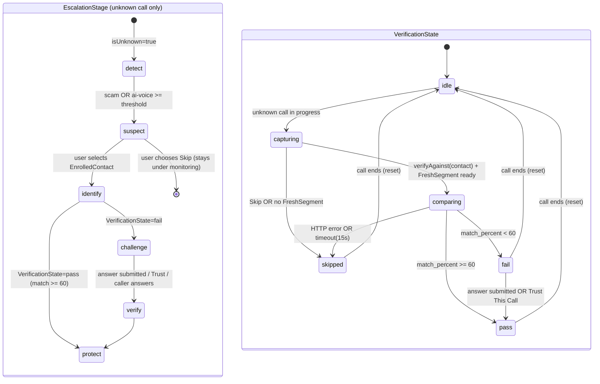
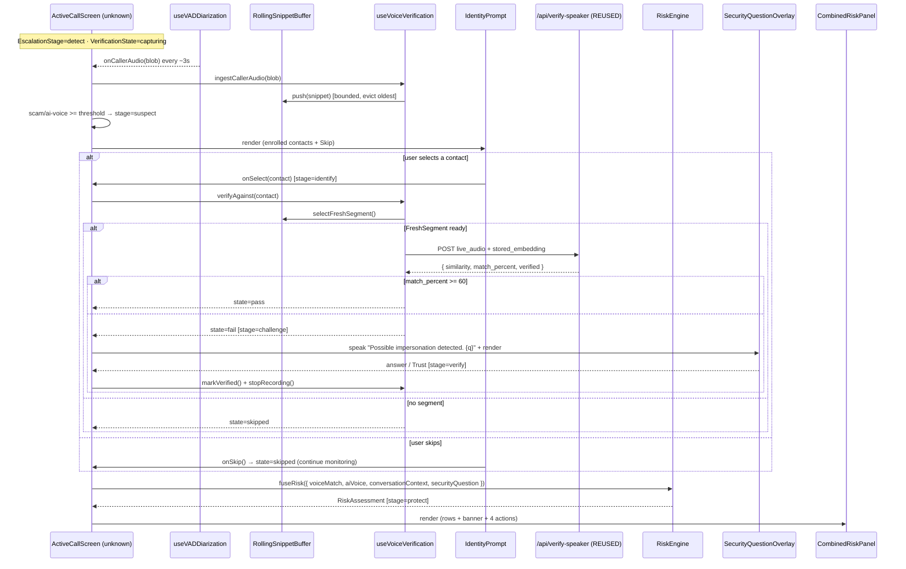

# Design Document: Voice Verification & Security

## Overview

This feature adds a **layered, multi-signal impersonation-verification flow** to VoiceShield's call experience, scoped **exclusively to unknown callers** (`caller.isUnknown === true`). Instead of a single unconditional voice check, the system fuses three independent signals — **Voice Match**, **AI Voice detection**, and **Conversation Context (scam risk)** — plus a **Security Question** outcome into a central **RiskEngine** that produces one overall assessment framed as *possible impersonation*. The user is then presented with a combined risk panel and chooses an action.

The flow follows a deliberate escalation narrative: **Detect → Suspect → Identify → Challenge → Verify → Protect**. While an unknown call is in progress, the existing scam and AI-voice detectors monitor the conversation (Detect). When either crosses its suspicion threshold, VoiceShield asks the user which **enrolled contact** the caller claims to be — or to **skip** (Suspect/Identify). Only after the user selects a claimed identity does VoiceShield compare a **fresh, clean caller-audio segment** against that contact's stored embedding (Identify). On a weak match the caller is challenged with the contact's security question (Challenge), the caller answers on the caller-side view (Verify), and finally the user sees a combined risk panel and decides (Protect).

### Reconciliation with existing code (critical)

This is an **update** that builds on plumbing already present in the codebase. It does **not** invent parallel systems.

| Concern | Existing code | This design |
|---|---|---|
| Unknown-caller gate | `ActiveCallScreen` already branches on `caller.isUnknown` | Reused as the single top-level guard for the whole flow |
| Known-contact behavior | `useVADDiarization` privacy filtering for enrolled speakers | **Unchanged** — known contacts keep diarization, no verification |
| Continuous caller audio | `useVADDiarization({ onCallerAudio: handleCallerAudio, windowMs: 3000 })` emits caller-only WAV every ~3 s; unknown callers also run a deepfake `AudioProcessor` buffering chunks | The **RollingSnippetBuffer** taps this **same** caller-audio stream — no new `AudioContext` |
| WAV encoding | `encodeWav(samples, sampleRate)` helper duplicated in `ActiveCallScreen`, `useVoiceMatch`, `useVADDiarization` | Reused verbatim (extracted to a shared util) |
| Voice comparison | `useVoiceMatch(contact)` auto-captures 5 s and POSTs to `/api/verify-speaker`; `VoiceMismatchOverlay` renders on `< 60%` | **Refactored** into on-demand `useVoiceVerification` driven by a selected contact + FreshSegment; `VoiceMismatchOverlay` evolves into `SecurityQuestionOverlay` |
| Backend verify | `/api/verify-speaker` **already exists** (reuses module-level `speaker_model` + embedding helper) | **REUSED as-is** |
| AI-voice detection | `/api/detect-deepfake` **already exists** (`ai_probability`, `human_probability`, `confidence_level`) | **REUSED**; `AIVoiceSignal` derives `synthetic_percent = ai_probability * 100`. `/api/detect-ai-voice` from the requirements is an **alias mapped onto `/api/detect-deepfake`** via a thin frontend adapter — no new backend endpoint required |
| Scam scoring | `/api/predict-scam` + `/api/analyze-scam` already polled by `ActiveCallScreen` | **REUSED**; `ConversationContextSignal` derives from the existing `scamProb` |
| Enrolled contacts | `useFamilyContacts(ownerPhone)` loads all contacts (with optional `speakerEmbedding`) from DynamoDB + local cache | **REUSED** to populate the identity prompt with *all* enrolled contacts, not just `caller.familyContact` |

**Known contacts are never disrupted.** The entire escalation flow is gated behind `caller.isUnknown === true`. For `isUnknown === false` the component renders exactly as today.

---

## Architecture

```
┌──────────────────────────────────────────────────────────────────────────┐
│  React / TypeScript Frontend                                              │
│                                                                            │
│  ScreenViewToggle (NEW)  ── protected ⇆ caller ──┐                        │
│                                                   │ shared state           │
│  ActiveCallScreen (MODIFIED)                      ▼                        │
│  ├── caller.isUnknown === false → EXISTING known-contact UI (UNCHANGED)   │
│  │        └── useVADDiarization (EXISTING privacy filtering)              │
│  └── caller.isUnknown === true  → escalation flow (NEW/refactored)        │
│        ├── useVADDiarization onCallerAudio ──► RollingSnippetBuffer (NEW) │
│        ├── deepfake AudioProcessor (EXISTING) ──► /api/detect-deepfake    │
│        ├── useVoiceVerification (REFACTOR of useVoiceMatch)               │
│        │     └── FreshSegmentSelector (NEW) → /api/verify-speaker (REUSED)│
│        ├── IdentityPrompt (NEW)                                           │
│        ├── SecurityQuestionOverlay (evolved VoiceMismatchOverlay)         │
│        ├── RiskEngine (NEW pure module)                                   │
│        │     signals: VoiceMatch · AIVoice · ConversationContext         │
│        │     + SecurityQuestionOutcome → RiskAssessment                   │
│        └── CombinedRiskPanel (NEW)                                        │
│                                                                            │
│  Existing scam flow: /api/predict-scam + /api/analyze-scam (REUSED)       │
└──────────────────────────────────────────────────────────────────────────┘
             │ POST /api/verify-speaker (REUSED)   │ POST /api/detect-deepfake (REUSED)
             ▼                                      ▼
┌──────────────────────────────────────────────────────────────────────────┐
│  Python FastAPI Backend (backend.py)                                      │
│  /api/verify-speaker   (EXISTING — reuses speaker_model + embedding help) │
│  /api/detect-deepfake  (EXISTING — DistilHuBERT AI-voice classifier)      │
│  /api/predict-scam · /api/analyze-scam · /api/compare-voices (EXISTING)   │
│  /api/speaker-embedding · /api/analyze-audio-segment (EXISTING)           │
│  (NO new backend endpoints required by this feature)                      │
└──────────────────────────────────────────────────────────────────────────┘
```

### Key architectural principles

- **Single guard, additive flow.** `caller.isUnknown === false` short-circuits the entire escalation path; the known-contact diarization branch is left byte-for-byte intact.
- **Reuse the audio stream that already exists.** The RollingSnippetBuffer subscribes to the caller-only WAV blobs already produced by `useVADDiarization.onCallerAudio` (3 s windows) rather than opening another microphone/`AudioContext`. This keeps a single mic capture per call.
- **On-demand only.** No comparison request is ever made until the user selects a claimed identity. Suspicion merely *offers* the prompt.
- **Pure RiskEngine.** Signal fusion is a deterministic pure function with no I/O, so it is trivially property-testable and recomputes well under the 500 ms budget.
- **Endpoint mapping over endpoint creation.** `/api/detect-ai-voice` and the verify path from the requirements are satisfied by the existing `/api/detect-deepfake` and `/api/verify-speaker`; a thin frontend adapter normalizes their shapes.
- **Graceful degradation.** Any backend error/timeout marks the relevant signal `unavailable` (or verification `skipped`); the RiskEngine tolerates missing signals and the call is never blocked.

---

## Components and Interfaces

### 1. `RollingSnippetBuffer` (NEW — `frontend/src/services/RollingSnippetBuffer.ts`)

A bounded FIFO of recent caller-audio snippets. Fed by the caller-only blobs already emitted by `useVADDiarization`. Decodes each incoming WAV blob back to `Float32Array` samples (at the buffer's working sample rate) so segments can be re-assembled and re-encoded on demand.

```typescript
export interface Snippet {
  samples: Float32Array   // mono PCM at `sampleRate`
  sampleRate: number
  durationMs: number
  capturedAt: number      // epoch ms
}

export interface RollingSnippetBufferConfig {
  /** Hard upper bound on retained audio (default 15_000 ms). */
  maxDurationMs?: number
  /** Hard upper bound on snippet count (default 8). Whichever bound hits first evicts. */
  maxSnippets?: number
  /** Minimum contiguous duration a FreshSegment must contain (default 4_000 ms). */
  minSegmentMs?: number
}

export class RollingSnippetBuffer {
  constructor(config?: RollingSnippetBufferConfig)

  /** Push a caller snippet; evicts the oldest until both bounds hold. */
  push(snippet: Snippet): void

  /** Total retained duration across all snippets. */
  get totalDurationMs(): number

  get size(): number

  /** True when at least `minSegmentMs` of audio is retained. */
  canAssembleSegment(): boolean

  /**
   * Assemble the freshest contiguous span >= minSegmentMs, encode it as a
   * mono RIFF WAV, and return the blob. Returns null if not enough audio.
   */
  selectFreshSegment(): FreshSegment | null

  /** Drop all retained audio (called on call end / cleanup). */
  clear(): void
}

export interface FreshSegment {
  wavBlob: Blob        // mono RIFF WAV, encodeWav()-compatible
  durationMs: number
  sampleRate: number
}
```

Invariants: after every `push`, `size <= maxSnippets` and `totalDurationMs <= maxDurationMs`, with the **newest** snippets retained.

### 2. `useVoiceVerification` (NEW — refactor of `useVoiceMatch`) — `frontend/src/hooks/useVoiceVerification.ts`

Replaces the auto-5-second `useVoiceMatch`. It owns the RollingSnippetBuffer, subscribes to caller audio, and performs the comparison **on demand** against a **selected** contact.

```typescript
export type VerificationState =
  | 'idle'        // no selection yet (default while merely monitoring)
  | 'capturing'   // buffer is being filled (unknown call in progress)
  | 'comparing'   // FreshSegment posted to /api/verify-speaker
  | 'pass'        // match_percent >= 60  OR  answered/trusted
  | 'fail'        // match_percent < 60
  | 'skipped'     // user skipped, no segment, HTTP error, or timeout

export interface VoiceVerificationResult {
  matchPercent: number   // 0–100  (from match_percent)
  similarity: number     // -1..1  (from similarity)
  verified: boolean      // matchPercent >= 60
}

export interface UseVoiceVerificationOptions {
  isUnknown: boolean
  /** Emits caller-only snippets (wire to useVADDiarization.onCallerAudio). */
  onCallerSnippet?: (blob: Blob) => void
}

export interface UseVoiceVerificationReturn {
  verificationState: VerificationState
  verificationResult: VoiceVerificationResult | null
  /** Feed a caller-audio blob into the rolling buffer (from diarization). */
  ingestCallerAudio: (blob: Blob) => void
  /** On-demand: select FreshSegment + POST verify-speaker for this contact. */
  verifyAgainst: (contact: FamilyContact) => void
  /** Force 'pass' (answered security question / Trust This Call). */
  markVerified: () => void
  /** Release audio, clear buffer, abort in-flight, reset to idle. */
  reset: () => void
}

export function useVoiceVerification(
  o: UseVoiceVerificationOptions,
): UseVoiceVerificationReturn
```

Behavior:
- While `isUnknown === true`, state is `capturing` and every ingested blob is pushed to the buffer.
- `verifyAgainst(contact)` selects a FreshSegment; if none → `skipped`; else `comparing`, then POST to `/api/verify-speaker` with `live_audio` (the FreshSegment WAV) and `stored_embedding` (the contact's `speakerEmbedding`), a 15 s `AbortController` timeout. `match_percent >= 60` → `pass`, else `fail`; HTTP error/timeout → `skipped`.
- Terminal states (`pass`/`fail`/`skipped`) do not restart comparison until `verifyAgainst` is called again with a new selection.
- `reset()` clears the buffer, aborts in-flight fetch, and sets `idle`.

### 3. `RiskEngine` (NEW pure module — `frontend/src/services/riskEngine.ts`)

No React, no I/O — pure functions, easy to property-test.

```typescript
export type SeverityLevel = 'low' | 'suspicious' | 'high' | 'failed'
export type OverallRiskLevel = 'low' | 'medium' | 'high'
export type SecurityQuestionOutcome =
  | 'unanswered' | 'correct' | 'incorrect' | 'bypassed'

export interface Signal {
  value: number | null         // 0–100, or null when unavailable
  severity: SeverityLevel | 'unavailable'
  available: boolean
}

export interface RiskInputs {
  voiceMatch: Signal
  aiVoice: Signal
  conversationContext: Signal
  securityQuestion: SecurityQuestionOutcome
}

export interface RiskAssessment {
  voiceMatch: Signal
  aiVoice: Signal
  conversationContext: Signal
  securityQuestion: SecurityQuestionOutcome
  overall: OverallRiskLevel
  banner: string               // non-empty, always "possible" framing
}

/** Map a raw 0–100 match percentage to a voice-match severity. */
export function voiceMatchSeverity(matchPercent: number): SeverityLevel
/** Map a 0–100 scam risk score to a severity. */
export function scamSeverity(scamPercent: number): SeverityLevel
/** Map a 0–100 synthetic-indicator score to a severity. */
export function aiVoiceSeverity(syntheticPercent: number): SeverityLevel

/** Deterministic fusion — applies the Requirement 12 precedence rules. */
export function fuseRisk(inputs: RiskInputs): RiskAssessment
```

Severity mapping (per signal, values 0–100):

| Signal | `low` | `suspicious` | `high` |
|---|---|---|---|
| Voice match (higher = safer, so inverted) | matchPercent ≥ 60 | 40 ≤ matchPercent < 60 | matchPercent < 40 (`failed` when comparison failed) |
| Scam risk | < 30 | 30–69 | ≥ 70 |
| AI voice (synthetic %) | < 40 | 40–69 | ≥ 70 |

`fuseRisk` precedence (stop at first match):
1. `securityQuestion === 'incorrect'` → `high`
2. ≥ 2 available signals are `high` or `suspicious` → `high`
3. exactly 1 available signal is `high` or `suspicious` → `medium`
4. `securityQuestion` is `correct` or `bypassed` → `low`
5. otherwise → `low`

A signal is "severe" for counting purposes when `available && (severity === 'high' || severity === 'suspicious')`. Voice `failed` counts as severe.

### 4. `IdentityPrompt` (NEW — `frontend/src/components/IdentityPrompt.tsx`)

Shown when suspicion is crossed on an unknown call (`EscalationStage === 'suspect'`).

```typescript
interface IdentityPromptProps {
  /** Enrolled contacts (only those with a speakerEmbedding). */
  enrolledContacts: FamilyContact[]
  onSelect: (contact: FamilyContact) => void   // → identify + verifyAgainst
  onSkip: () => void                            // → VerificationState 'skipped'
}
```

Enrolled contacts come from `useFamilyContacts(ownerPhone).contacts.filter(c => c.speakerEmbedding)` — the full list, not just the current caller. Always renders an explicit **Skip verification** control.

### 5. `SecurityQuestionOverlay` (evolved from `VoiceMismatchOverlay`) — `frontend/src/components/SecurityQuestionOverlay.tsx`

Rendered when `verificationState === 'fail'`. Retains the existing overlay's SpeechSynthesis + Trust/End actions; wording changes to the tentative tier and it gains a typed-answer input.

```typescript
interface SecurityQuestionOverlayProps {
  contact: FamilyContact                 // the SELECTED claimed identity
  verificationResult: VoiceVerificationResult
  onAnswerSubmitted: (answer: string) => void  // non-empty → verified
  onTrustCall: () => void                       // "Trust This Call"
  onMarkAsScam: () => void                       // "Mark as Scam & End Call" → onEndCall
}
```

- Speaks `"Possible impersonation detected. {question}"` (tentative wording).
- Question falls back to `"What is your full name?"` when the contact's `securityQuestion` is blank/whitespace.
- Shows match % and the tentative banner `⚠️ Possible impersonation` while the challenge is incomplete.
- Text input + **Submit Answer** (enabled only for non-empty input), **Trust This Call**, **Mark as Scam & End Call**.
- If `window.speechSynthesis` is unavailable/throws, the overlay still renders (existing `try/catch` pattern preserved).

### 6. `CombinedRiskPanel` (NEW — `frontend/src/components/CombinedRiskPanel.tsx`)

Rendered when `EscalationStage === 'protect'`.

```typescript
interface CombinedRiskPanelProps {
  assessment: RiskAssessment
  isMuted: boolean
  onContinue: () => void
  onToggleMute: () => void
  onEndCall: () => void
  onReport: () => Promise<void>   // rejects → show error, retain panel
}
```

- Four labeled rows using exactly `"VOICE MATCH"`, `"AI VOICE"`, `"SCAM RISK"`, `"SECURITY QUESTION"`, each with a value and a severity chip (`⚠️ Low`, `⚠️ Suspicious`, `🔴 High`, `🔴 Failed`). Unavailable signals render an "unavailable" indicator instead of a number.
- Summary banner beneath rows.
- Exactly four actions: **Continue Call**, **Mute**, **End Call**, **Report** with the mute-toggle + report confirmation/failure behavior.

### 7. `ScreenViewToggle` + shared state (NEW — `frontend/src/components/ScreenViewToggle.tsx`)

A two-way toggle between `protected` and `caller` views. Both views read/write the **same** `RiskEngine` inputs and `VerificationState` via a shared React context/store so actions on one view reflect immediately on the other without a reload.

```typescript
export type ScreenView = 'protected' | 'caller'

interface CallSecurityContextValue {
  screenView: ScreenView
  setScreenView: (v: ScreenView) => void        // no reload
  escalationStage: EscalationStage
  verificationState: VerificationState
  verificationResult: VoiceVerificationResult | null
  assessment: RiskAssessment
  securityQuestionOutcome: SecurityQuestionOutcome
  submitCallerAnswer: (answer: string, correct: boolean) => void  // caller view
}
```

The caller view shows scripted lines (e.g. "Hey, I'm your brother. I need money urgently.") and the identity challenge "What was the name of your first school?", plus a control to record an answer that updates `SecurityQuestionOutcome` (wrong → `incorrect`). The protected view reflects each `EscalationStage` transition as it occurs.

### 8. `ActiveCallScreen` (MODIFIED — `frontend/src/components/ActiveCallScreen.tsx`)

- Keep the existing `caller.isUnknown` branch; the entire escalation flow lives under the `isUnknown === true` path.
- Wire `useVADDiarization.onCallerAudio` (still `handleCallerAudio`) to also call `voiceVerification.ingestCallerAudio(blob)`.
- Manage `escalationStage` with an ordered reducer (see state machine) that rejects out-of-order transitions.
- Advance `detect → suspect` when `scamProb` or the AI-voice severity crosses threshold; render `IdentityPrompt`.
- On contact selection: `identify` + `verifyAgainst(contact)`. On `fail`: `challenge` + `SecurityQuestionOverlay`. On answered/trusted: `verify` → `markVerified()` + `stopRecording()` + `stopDiarization()` (reuse existing `handleVerified`). Then `protect` + `CombinedRiskPanel`.
- Suppress `/api/predict-scam` + `/api/analyze-scam` while `verificationState === 'pass'` (existing `callVerified` guard is generalized to this).

### Backend endpoints (all REUSED — none new)

```python
# EXISTING — reused unchanged
POST /api/verify-speaker
  form: live_audio: UploadFile (WAV), stored_embedding: str (JSON SpeakerEmbedding)
  → { similarity: float, match_percent: float, verified: bool }

# EXISTING — reused; frontend adapter maps ai_probability → synthetic_percent
POST /api/detect-deepfake
  form: audio: UploadFile (WAV)
  → { is_ai_generated, ai_probability, human_probability, confidence_level }

# EXISTING — reused for ConversationContextSignal
POST /api/predict-scam   → { scam_probability, ... }
POST /api/analyze-scam   → { summary, verification_questions, risk_level, ... }
```

Frontend `detectAiVoice(blob)` adapter:
```typescript
// synthetic_percent = ai_probability * 100
// severity: >=70 → 'suspicious' | 'high'; 40–69 → 'suspicious'; else 'low'
// error / empty / timeout → signal marked unavailable
```

---

## Data Models

### `VerificationState`
```
'idle' | 'capturing' | 'comparing' | 'pass' | 'fail' | 'skipped'
```

### `EscalationStage`
```
'detect' | 'suspect' | 'identify' | 'challenge' | 'verify' | 'protect'
```

### `VoiceVerificationResult`
```typescript
{ matchPercent: number /*0–100*/, similarity: number /*-1..1*/, verified: boolean }
```

### `Signal` / `RiskAssessment` — see RiskEngine interfaces above.

### `SecurityQuestionOutcome`
```
'unanswered' | 'correct' | 'incorrect' | 'bypassed'
```

### `/api/verify-speaker` (REUSED)

| Field | Type | Description |
|---|---|---|
| `live_audio` | multipart WAV | FreshSegment mono RIFF WAV |
| `stored_embedding` | form JSON string | `SpeakerEmbedding` `{ vector, dim, generatedAt }` |

Response: `{ similarity: float(-1..1), match_percent: float(0..100), verified: bool }`.

### `/api/detect-deepfake` (REUSED) → adapted to `AIVoiceSignal`
Response `{ ai_probability, human_probability, confidence_level }` → `synthetic_percent = ai_probability*100`.

---

## VerificationState + EscalationStage State Machine



Terminal `VerificationState`s during a call are `pass`, `fail`, `skipped`; none restart comparison until a new `verifyAgainst` selection. `EscalationStage` only advances one step in the fixed order `detect → suspect → identify → challenge → verify → protect`; any out-of-order request is rejected and the current stage retained.

---

## On-Demand Verification Sequence



---

## Correctness Properties

*A property is a characteristic or behavior that should hold true across all valid executions of a system — essentially, a formal statement about what the system should do. Properties serve as the bridge between human-readable specifications and machine-verifiable correctness guarantees.*

### Property 1: Known callers bypass the entire flow

*For any* caller with `isUnknown === false`, the verification controller must never push to the RollingSnippetBuffer, never enter `capturing`/`comparing`, and never POST to `/api/verify-speaker`, regardless of elapsed time or signal values.

**Validates: Requirements 1.1**

---

### Property 2: Unknown calls begin in detect and capturing

*For any* call with `isUnknown === true`, the initial `EscalationStage` must be `detect` and, while the call is in progress, `VerificationState` must be `capturing`.

**Validates: Requirements 1.2, 2.1**

---

### Property 3: Suspicion threshold offers the identity prompt

*For any* scam-risk or AI-voice severity value that reaches its configured suspicion threshold on an unknown call, `EscalationStage` must advance to `suspect` and the `IdentityPrompt` must be rendered; for any value strictly below threshold the stage must remain `detect`.

**Validates: Requirements 1.3**

---

### Property 4: Identity prompt lists only enrolled contacts plus Skip

*For any* set of family contacts, the `IdentityPrompt` must list exactly those contacts that have a non-null `speakerEmbedding` and must always render an explicit Skip control.

**Validates: Requirements 1.4**

---

### Property 5: Comparison is on-demand only

*For any* unknown call in which the user has not selected a claimed identity, zero POST requests to `/api/verify-speaker` must be made no matter how much caller audio is ingested; and selecting Skip must leave `VerificationState === 'skipped'` with zero comparison requests.

**Validates: Requirements 1.5, 1.6, 3.1, 6.2**

---

### Property 6: EscalationStage transitions are strictly ordered

*For any* sequence of requested stage transitions, a transition is applied only if the target is the immediate successor of the current stage in `detect → suspect → identify → challenge → verify → protect`; every out-of-order request leaves the current stage unchanged.

**Validates: Requirements 1.8, 1.9**

---

### Property 7: RollingSnippetBuffer stays bounded and keeps the newest audio

*For any* sequence of snippet pushes, after each push `size <= maxSnippets` and `totalDurationMs <= maxDurationMs`, and the retained snippets are exactly the most recent ones (oldest evicted first).

**Validates: Requirements 2.2, 2.3, 6.1**

---

### Property 8: FreshSegment encodes as a valid mono WAV

*For any* assembled sample buffer, `selectFreshSegment` must produce a RIFF WAV blob whose header declares exactly 1 channel and a `data` chunk size equal to `numSamples × 2` bytes, matching the enrollment recorder's `encodeWav` format.

**Validates: Requirements 2.4, 2.5**

---

### Property 9: Capture stops when the call ends

*For any* call that has ended, further ingested caller audio must not change the RollingSnippetBuffer contents.

**Validates: Requirements 2.6**

---

### Property 10: Match threshold drives verification state

*For any* `match_percent` returned by `/api/verify-speaker`: when `match_percent >= 60`, `VerificationState` must be `pass` and `verificationResult.verified` must be `true`; when `match_percent < 60`, state must be `fail` and `verified` must be `false`.

**Validates: Requirements 3.3, 3.4, 3.5**

---

### Property 11: Missing segment or backend failure degrades to skipped

*For any* selection where no FreshSegment can be assembled, OR any HTTP error status, OR a request that exceeds the 15 s timeout, `VerificationState` must become `skipped`, no `SecurityQuestionOverlay` must be rendered, and the remaining signals must still be forwarded to the RiskEngine.

**Validates: Requirements 3.6, 3.7, 3.8**

---

### Property 12: Verification failure triggers tentative speech and overlay

*For any* transition of `VerificationState` to `fail`, `window.speechSynthesis.speak` must be invoked with an utterance containing the phrase "Possible impersonation" and the selected contact's security-question text, and the `SecurityQuestionOverlay` must be rendered.

**Validates: Requirements 4.1, 4.2, 4.3**

---

### Property 13: Blank security question substitutes the default text

*For any* selected contact whose `securityQuestion` is empty or entirely whitespace, both the spoken utterance and the overlay display text must contain "What is your full name?" instead of the blank value.

**Validates: Requirements 4.7**

---

### Property 14: Answer or trust stops monitoring identically

*For any* non-empty answer submission OR "Trust This Call" click, all of the following must hold simultaneously: the `SecurityQuestionOverlay` is no longer rendered, `VerificationState === 'pass'`, and `stopRecording()` has been called exactly once. Empty/whitespace answers must not trigger any of these.

**Validates: Requirements 5.1, 5.2, 5.3**

---

### Property 15: Verified state suppresses all scam API calls

*For any* change to the caller transcript while `VerificationState === 'pass'`, no fetch to `/api/predict-scam` or `/api/analyze-scam` must be dispatched.

**Validates: Requirements 5.5**

---

### Property 16: Call end releases all capture resources

*For any* call that ends, the RollingSnippetBuffer must be cleared, any in-flight comparison must be aborted, `VerificationState` must reset to `idle`, and no FreshSegment blob may be retained.

**Validates: Requirements 6.3, 6.4**

---

### Property 17: Signal value maps to a stable severity band

*For any* raw value in `[0, 100]`, `voiceMatchSeverity`, `scamSeverity`, and `aiVoiceSeverity` must each return the severity band defined by their documented thresholds; in particular a synthetic-indicator value `>= 70` must map to `suspicious` or `high`.

**Validates: Requirements 10.2, 10.3, 10.4, 11.2, 11.3**

---

### Property 18: RiskEngine tolerates any combination of unavailable signals

*For any* assignment of `available`/`unavailable` across the three signals, `fuseRisk` must not throw, must mark unavailable signals accordingly, and must compute an `OverallRiskLevel` from the remaining available signals.

**Validates: Requirements 10.5, 11.6, 13.12**

---

### Property 19: Fusion precedence is correct and complete

*For any* combination of the three signal severities and any `SecurityQuestionOutcome`, `fuseRisk` must produce an `OverallRiskLevel` equal to the result of applying, in order and stopping at the first match: (a) incorrect → high; (b) ≥ 2 severe available signals → high; (c) exactly 1 severe → medium; (d) correct/bypassed → low; (e) otherwise → low. The returned `RiskAssessment` must always contain all four inputs, the three severities, an overall level, and a non-empty banner.

**Validates: Requirements 12.1, 12.2, 12.3, 12.4, 12.5, 12.6, 12.7**

---

### Property 20: Wording never asserts confirmed fraud

*For any* `RiskAssessment` produced by `fuseRisk`, the banner must never contain the substrings "confirmed", "identity theft", or "fraud"; when `overall === 'high'` the banner must be the specified "🚨 Possible impersonation — …" message; and the tentative tier (voice weak, outcome `unanswered`) must use "⚠️ Possible impersonation" and never definitive wording.

**Validates: Requirements 9.1, 9.2, 9.3, 9.4, 9.5, 12.8**

---

### Property 21: CombinedRiskPanel renders the fixed labels and mute toggle is involutive

*For any* set of available signals, the `CombinedRiskPanel` must render rows using exactly the labels "VOICE MATCH", "AI VOICE", "SCAM RISK", "SECURITY QUESTION" (unavailable signals showing an unavailable indicator), and toggling Mute twice from any starting mute state must return the microphone to its original mute state.

**Validates: Requirements 13.2, 13.3, 13.8, 13.9, 13.12**

---

### Property 22: Screen toggle shares verification and risk state

*For any* change to `VerificationState`, `EscalationStage`, or the `RiskAssessment` made while on one `ScreenView`, switching to the other view must reflect the identical values (shared state, no reset, no reload).

**Validates: Requirements 14.2, 14.7**

---

### Property 23: Backend verify-speaker schema completeness

*For any* valid `(live_audio WAV, stored_embedding)` pair sent to `/api/verify-speaker`, the response must contain `similarity` (float), `match_percent` (float), and `verified` (boolean) with conforming types.

**Validates: Requirements 7.3**

---

### Property 24: Backend rejects malformed verify-speaker input

*For any* request where `live_audio` is empty OR `stored_embedding` is malformed or has the wrong dimension, `/api/verify-speaker` must return HTTP 400 with a non-empty error detail.

**Validates: Requirements 7.4, 7.5**

---

### Property 25: Round-trip embedding self-consistency

*For any* valid WAV `W`, computing an embedding `E` via `/api/speaker-embedding` then calling `/api/verify-speaker` with `W` and `E` must return `similarity >= 0.20`.

**Validates: Requirements 8.2**

---

## Error Handling

| Scenario | Behavior |
|---|---|
| Microphone access denied | Diarization/capture start rejects; buffer stays empty; verification → `skipped` |
| User selects Skip | `VerificationState = 'skipped'`; no comparison; monitoring continues |
| No FreshSegment assemblable | `skipped`; remaining signals still fed to RiskEngine |
| `/api/verify-speaker` 4xx/5xx | `skipped`; no overlay; call uninterrupted |
| `/api/verify-speaker` timeout (> 15 s) | `AbortController` aborts; `skipped` |
| `/api/detect-deepfake` error/empty/timeout | `AIVoiceSignal` marked `unavailable`; RiskEngine uses remaining signals |
| `window.speechSynthesis` unavailable/throws | `try/catch`; `SecurityQuestionOverlay` still renders |
| Empty/whitespace answer submitted | Submit stays disabled; no state change |
| Report submission fails | Error shown; `CombinedRiskPanel` retained for retry |
| Call ends during `comparing` | In-flight fetch aborted; buffer cleared; state → `idle` |
| `stored_embedding.dim` mismatch | Backend 400; frontend → `skipped` |
| `speaker_model` not loaded | Backend 503 "Speaker embedding model is not available."; frontend → `skipped` |
| Out-of-order stage transition requested | Rejected; current `EscalationStage` retained |

All error paths degrade to `skipped`/`unavailable` and never block the call.

---

## Testing Strategy

### Unit tests

- **RollingSnippetBuffer** — bound enforcement, oldest-eviction, `canAssembleSegment`, `clear()` on end (Properties 7, 9, 16).
- **encodeWav / FreshSegment** — RIFF header, mono, `dataSize = n×2` (Property 8).
- **useVoiceVerification** (React Testing Library + fake timers) — unknown gate, on-demand-only, threshold → state, error/timeout → skipped, `markVerified`, terminal idempotence, `reset()` cleanup (Properties 1, 2, 5, 10, 11, 14, 16).
- **riskEngine** — severity bands, unavailable tolerance, precedence, banner wording (Properties 17–20).
- **IdentityPrompt** — enrolled-only listing + Skip (Property 4).
- **SecurityQuestionOverlay** — tentative wording, default-question fallback, submit-disabled on empty, Trust/End wiring, speechSynthesis-unavailable still renders (Properties 12, 13; Reqs 4.4–4.6, 4.8).
- **CombinedRiskPanel** — fixed labels, chips, unavailable indicator, mute toggle, Continue/End/Report wiring incl. failure retain (Property 21; Reqs 13.1, 13.4–13.7, 13.10, 13.11).
- **ScreenViewToggle** — bidirectional switch, shared-state reflection, scripted lines, caller answer → outcome (Property 22; Reqs 14.1, 14.3–14.6, 14.8).
- **ActiveCallScreen** — verified suppresses scam fetches, fail renders overlay, protect renders panel (Properties 3, 6, 15).
- **Backend `/api/verify-speaker`** — schema, empty/malformed → 400, model-unloaded → 503 (Properties 23, 24; Reqs 7.6, 8.1).

### Property-based tests

Property-based testing applies here because the feature contains several pure functions and threshold/precedence rules whose correctness must hold across all valid inputs (the RiskEngine, severity mappings, buffer bounds, WAV encoding, verify-speaker schema). Libraries: **fast-check** (TypeScript) and **Hypothesis** (Python). Each test runs a **minimum of 100 iterations** and is tagged `Feature: voice-verification-security, Property {n}: {text}`.

Not suitable for PBT (use example/integration tests instead): endpoint wiring (`/api/verify-speaker` POST shape, `/api/detect-deepfake` adapter), timeouts, rendering-only assertions, and UI toggles.

**TypeScript (fast-check)**

```typescript
// Feature: voice-verification-security, Property 10: Match threshold drives verification state
fc.assert(fc.property(fc.float({ min: 0, max: 100 }), (mp) => {
  const { state, verified } = deriveVerification(mp)
  return mp >= 60 ? (state === 'pass' && verified) : (state === 'fail' && !verified)
}), { numRuns: 100 })

// Feature: voice-verification-security, Property 7: Rolling buffer stays bounded
fc.assert(fc.property(fc.array(arbSnippet(), { maxLength: 200 }), (snips) => {
  const buf = new RollingSnippetBuffer({ maxSnippets: 8, maxDurationMs: 15_000 })
  snips.forEach(s => buf.push(s))
  return buf.size <= 8 && buf.totalDurationMs <= 15_000
}), { numRuns: 100 })

// Feature: voice-verification-security, Property 19: Fusion precedence is correct
fc.assert(fc.property(arbRiskInputs(), (inputs) => {
  return fuseRisk(inputs).overall === referenceFuse(inputs)
}), { numRuns: 100 })

// Feature: voice-verification-security, Property 20: Wording never asserts confirmed fraud
fc.assert(fc.property(arbRiskInputs(), (inputs) => {
  const b = fuseRisk(inputs).banner.toLowerCase()
  return !b.includes('confirmed') && !b.includes('identity theft') && !b.includes('fraud')
}), { numRuns: 100 })

// Feature: voice-verification-security, Property 13: Blank question → default
fc.assert(fc.property(fc.stringMatching(/^\s*$/), (blank) =>
  resolveSecurityQuestion(blank) === 'What is your full name?'
), { numRuns: 100 })
```

**Python (Hypothesis)**

```python
# Feature: voice-verification-security, Property 25: Round-trip embedding self-consistency
@given(st.binary(min_size=44100, max_size=160000))
@settings(max_examples=100)
def test_round_trip_similarity(wav_bytes):
    assume(is_valid_wav(wav_bytes))
    e = compute_embedding(wav_bytes)
    assert cosine_similarity(e, e) >= 0.20

# Feature: voice-verification-security, Property 24: verify-speaker rejects malformed input
@given(st.lists(st.floats(allow_nan=False), min_size=1, max_size=191))
@settings(max_examples=100)
def test_wrong_dimension_returns_400(wrong_dim):
    r = client.post("/api/verify-speaker",
        files={"live_audio": valid_wav_bytes},
        data={"stored_embedding": json.dumps({"vector": wrong_dim, "dim": len(wrong_dim)})})
    assert r.status_code == 400 and r.json().get("detail")
```

### Integration tests

- Enroll a contact, simulate an unknown call, ingest that speaker's audio, select the contact → `VerificationState` reaches `pass`.
- POST a known-good WAV pair to `/api/verify-speaker`; assert `match_percent > 60` and response within 10 s (Req 7.7).
- `/api/detect-deepfake` adapter: post a WAV, assert `synthetic_percent` and severity populate the `AIVoiceSignal`.
- Timeout path: slow-respond mock for `/api/verify-speaker` > 15 s → `skipped` without disrupting the call.
- Screen toggle end-to-end: caller records a wrong answer → `SecurityQuestionOutcome = 'incorrect'` → protected view shows escalated "🚨 Impersonation risk: HIGH".
