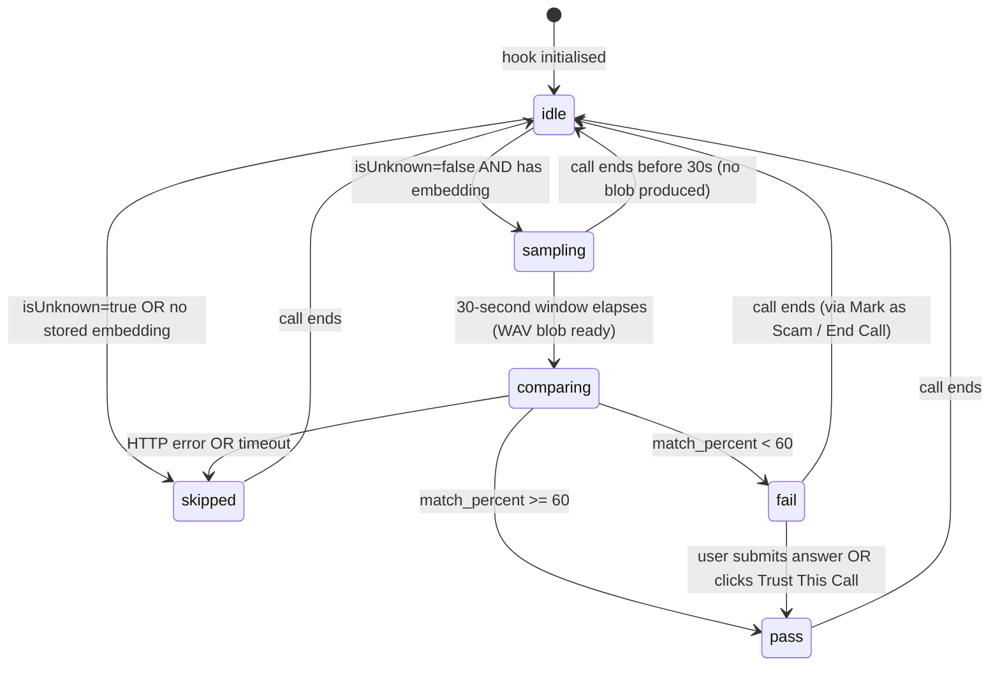
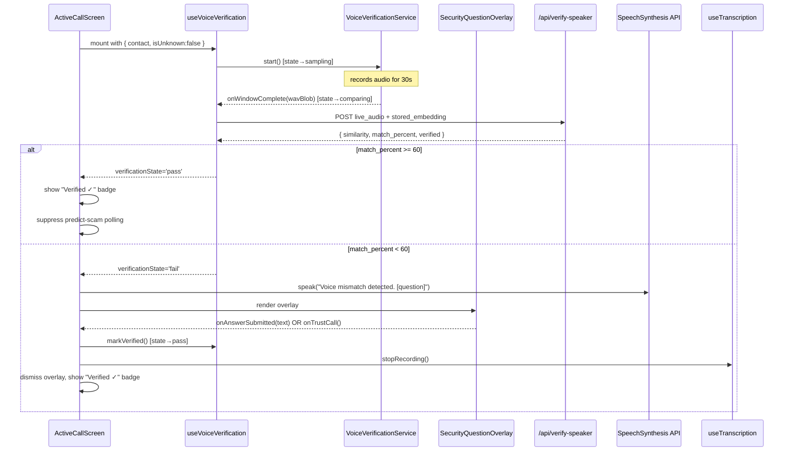

# Design Document: Voice Verification & Security

## Overview

This feature adds a voice-identity verification layer to VoiceShield's family-member call flow. When a call begins with a saved family contact who has a stored speaker embedding, the system silently captures the first 30 seconds of audio, generates a live ECAPA-TDNN embedding, and compares it to the stored one. If the similarity falls below a 60% match threshold the caller is challenged via an audio prompt and an on-screen security question overlay. Once the caller is verified — by voice match, a correct security question answer, or the user choosing to trust the call — transcription and scam monitoring stop for the remainder of that call.

**Unknown callers are completely unaffected.** The entire feature is gated behind the `isUnknown === false` and `speakerEmbedding !== undefined` checks and introduces zero changes to the existing scam-detection path for unknown or unregistered callers.

---

## Architecture

The feature spans three layers of the existing stack:

```
┌─────────────────────────────────────────────────────────────────┐
│  React / TypeScript Frontend                                    │
│                                                                 │
│  ActiveCallScreen (modified)                                    │
│  ├── useVoiceVerification (new hook)                            │
│  │   └── VoiceVerificationService (new service)                │
│  └── SecurityQuestionOverlay (new component)                    │
│                                                                 │
│  Existing (unchanged for unknown callers):                      │
│  ├── useTranscription                                           │
│  └── FreezeOverlay / predict-scam polling                       │
└─────────────────────────────────────────────────────────────────┘
                           │  POST /api/verify-speaker
                           ▼
┌─────────────────────────────────────────────────────────────────┐
│  Python FastAPI Backend (backend.py — modified)                 │
│                                                                 │
│  /api/verify-speaker  (new endpoint)                            │
│  Reuses existing:                                               │
│  ├── speaker_model  (SpeechBrain ECAPA-TDNN, module-level)      │
│  └── _wav_bytes_to_embedding()  helper                          │
└─────────────────────────────────────────────────────────────────┘
                           │  (unchanged)
                           ▼
┌─────────────────────────────────────────────────────────────────┐
│  AWS DynamoDB  ·  Amazon Transcribe  ·  Amazon Bedrock          │
│  (all unchanged)                                                │
└─────────────────────────────────────────────────────────────────┘
```

### Key architectural principles

- **Additive only for known contacts.** A single guard at the top of `ActiveCallScreen` short-circuits the entire verification path for `caller.isUnknown === true`.
- **No WAV storage.** The frontend never persists the live audio after it is submitted to the backend. The stored `SpeakerEmbedding` vector (already in DynamoDB) is sent as JSON rather than reconstructing a WAV from it.
- **Model reuse.** The new `/api/verify-speaker` endpoint shares the module-level `speaker_model` and `_wav_bytes_to_embedding()` already used by `/api/speaker-embedding` and `/api/compare-voices`.
- **Graceful degradation.** Any backend error or timeout during verification sets `VerificationState` to `skipped`, leaving the existing scam-detection flow completely uninterrupted.

---

## Components and Interfaces

### 1. `VoiceVerificationService` (new — `frontend/src/services/VoiceVerificationService.ts`)

Responsible for audio capture within the 30-second window and encoding the result as a RIFF WAV blob. Mirrors the Web Audio API pattern already used by `VoiceSampleRecorder` and `VoiceCompareTool`.

```typescript
export interface VoiceVerificationServiceConfig {
  windowMs: number       // default 30_000
  onWindowComplete: (wavBlob: Blob) => void
  onStopped: () => void
}

export class VoiceVerificationService {
  constructor(config: VoiceVerificationServiceConfig)

  /** Begin capturing microphone audio immediately. */
  start(): Promise<void>

  /**
   * Stop capturing.  If the window has NOT yet elapsed, waits are cancelled
   * and no blob is produced (onWindowComplete is not called).
   */
  stop(): void

  /** True while actively recording. */
  get isActive(): boolean
}
```

Internally the service:
1. Opens an `AudioContext` and `ScriptProcessorNode` (4096-frame buffer, same as `VoiceSampleRecorder`).
2. Accumulates `Float32Array` chunks in memory.
3. At exactly `windowMs` milliseconds calls `stop()` internally, merges all chunks, calls `encodeWav()` (identical implementation to `VoiceSampleRecorder`), and fires `onWindowComplete(wavBlob)`.
4. On early `stop()` (call ended before window) fires `onStopped()` without producing a blob.
5. Clears the in-memory sample buffer immediately after the blob is handed to the callback.

### 2. `useVoiceVerification` (new — `frontend/src/hooks/useVoiceVerification.ts`)

Orchestrates the full verification lifecycle. Consumed by `ActiveCallScreen`.

```typescript
export type VerificationState =
  | 'idle'
  | 'sampling'
  | 'comparing'
  | 'pass'
  | 'fail'
  | 'skipped'

export interface VoiceVerificationResult {
  matchPercent: number   // 0–100
  similarity: number     // cosine similarity, -1 to 1
  verified: boolean      // true when matchPercent >= 60
}

export interface UseVoiceVerificationOptions {
  contact: FamilyContact | null
  isUnknown: boolean
  onCallEnd: () => void  // called when hook should clean up
}

export interface UseVoiceVerificationReturn {
  verificationState: VerificationState
  verificationResult: VoiceVerificationResult | null
  /** Force the state to 'pass' (called by trust / answered security question). */
  markVerified: () => void
}

export function useVoiceVerification(
  options: UseVoiceVerificationOptions,
): UseVoiceVerificationReturn
```

State transition logic lives entirely in this hook. See the state machine section below.

### 3. `SecurityQuestionOverlay` (new — `frontend/src/components/SecurityQuestionOverlay.tsx`)

A modal overlay rendered by `ActiveCallScreen` when `verificationState === 'fail'`. Styled consistently with `FreezeOverlay`.

```typescript
interface SecurityQuestionOverlayProps {
  contact: FamilyContact
  verificationResult: VoiceVerificationResult
  onAnswerSubmitted: (answer: string) => void   // non-empty text → verified
  onTrustCall: () => void                       // "Trust This Call"
  onMarkAsScam: () => void                      // "Mark as Scam & End Call"
}
```

Rendered content:
- Match percentage badge (colour-coded: ≥ 60 green, 40–59 amber, < 40 red)
- Voice mismatch message
- Security question text (or "What is your full name?" if blank/whitespace)
- Controlled `<input type="text">` for the answer
- **Submit Answer** button — enabled only when input is non-empty
- **Trust This Call** button — bypasses answer check
- **Mark as Scam & End Call** button — calls `onMarkAsScam`

### 4. `ActiveCallScreen` (modified — `frontend/src/components/ActiveCallScreen.tsx`)

Two blocks of new logic are added; all existing paths for unknown callers remain intact.

**Added state:**
```typescript
const { verificationState, verificationResult, markVerified } =
  useVoiceVerification({ contact, isUnknown: caller.isUnknown, onCallEnd: handleEndCall })

const [showSecurityOverlay, setShowSecurityOverlay] = useState(false)
```

**Guard — no change to scam flow for unknown callers:**
```
if (caller.isUnknown)  →  render existing UI exactly as today
```

**New conditional renders:**
- Sampling indicator badge when `verificationState === 'sampling'`
- Replace scam risk bar with "Verified ✓" badge when `verificationState === 'pass'`
- `SecurityQuestionOverlay` when `showSecurityOverlay === true`

**Suppress scam polling when verified:**
```typescript
// Inside the predict-scam useEffect, add at the top:
if (verificationState === 'pass') return
```

**`onAnswerSubmitted` handler:**
```typescript
const handleSecurityAnswerSubmitted = useCallback(() => {
  setShowSecurityOverlay(false)
  markVerified()
  stopRecording()
}, [markVerified, stopRecording])
```

**`onTrustCall` handler:** identical outcome to `handleSecurityAnswerSubmitted`.

### 5. `POST /api/verify-speaker` (new backend endpoint — `backend/backend.py`)

```python
@app.post("/api/verify-speaker")
async def verify_speaker(
    live_audio: UploadFile = File(...),
    stored_embedding: str  = Form(...),   # JSON string: {"vector": [...], "dim": N, ...}
):
    ...
    # Returns:
    # { "similarity": float, "match_percent": float, "verified": bool }
```

Reuses `_wav_bytes_to_embedding()` for `live_audio`. Parses `stored_embedding` JSON, validates dimension matches `speaker_model` output, computes cosine similarity via `torch.nn.functional.cosine_similarity`, maps to `match_percent = (similarity + 1) / 2 * 100` (clamped 0–100), sets `verified = match_percent >= 60`.

---

## Data Models

### `VerificationState` (frontend)

```
'idle' | 'sampling' | 'comparing' | 'pass' | 'fail' | 'skipped'
```

### `VoiceVerificationResult` (frontend)

```typescript
interface VoiceVerificationResult {
  matchPercent: number   // 0–100 (from API match_percent field)
  similarity: number     // -1 to 1 (from API similarity field)
  verified: boolean      // true when matchPercent >= 60
}
```

### Backend request — `POST /api/verify-speaker`

| Field | Type | Description |
|---|---|---|
| `live_audio` | multipart WAV file | Raw RIFF WAV captured during the 30-second verification window |
| `stored_embedding` | form field (JSON string) | `SpeakerEmbedding` object: `{ vector: number[], dim: number, generatedAt: string }` |

### Backend response — `POST /api/verify-speaker`

```python
class VerifySpeakerResponse(BaseModel):
    similarity:    float   # cosine similarity, range -1 to 1
    match_percent: float   # (similarity + 1) / 2 * 100, clamped 0–100
    verified:      bool    # match_percent >= 60
```

---

## VerificationState State Machine



Terminal states during a call are `pass`, `fail`, and `skipped`. Once any terminal state is reached the hook does not restart sampling regardless of elapsed time.

---

## Component Interaction Diagram



---

## Correctness Properties

*A property is a characteristic or behavior that should hold true across all valid executions of a system — essentially, a formal statement about what the system should do. Properties serve as the bridge between human-readable specifications and machine-verifiable correctness guarantees.*

### Property 1: Unknown callers bypass verification

*For any* `CallerInfo` where `isUnknown === true`, calling `useVoiceVerification` should leave `verificationState` as `'idle'` and should never transition to `'sampling'`, regardless of how much time elapses.

**Validates: Requirements 1.1**

---

### Property 2: Known contacts with embeddings enter sampling

*For any* `FamilyContact` that has a non-null `speakerEmbedding`, initiating a call with that contact should cause `useVoiceVerification` to transition `verificationState` to `'sampling'`; contacts without an embedding should transition to `'skipped'`.

**Validates: Requirements 1.2, 1.3**

---

### Property 3: Verification window produces a valid WAV blob

*For any* audio sample buffer captured during the 30-second window, `VoiceVerificationService` should produce a RIFF WAV blob whose header declares exactly 1 channel and a data size equal to `numSamples × 2` bytes.

**Validates: Requirements 2.2, 2.5**

---

### Property 4: Early call-end suppresses comparison request

*For any* call ended before the 30-second window elapses, `useVoiceVerification` should make zero POST requests to `/api/verify-speaker`.

**Validates: Requirements 2.4, 6.3**

---

### Property 5: Match threshold drives state correctly

*For any* `match_percent` value returned by the backend:
- When `match_percent >= 60`, `verificationState` must be `'pass'` and `verificationResult.verified` must be `true`.
- When `match_percent < 60`, `verificationState` must be `'fail'` and `verificationResult.verified` must be `false`.

**Validates: Requirements 3.3, 3.4**

---

### Property 6: Backend error or timeout sets state to skipped

*For any* HTTP error status or request timeout from `/api/verify-speaker`, `verificationState` must become `'skipped'` and `SecurityQuestionOverlay` must not be rendered.

**Validates: Requirements 3.5, 3.6**

---

### Property 7: Verification failure triggers speech and overlay

*For any* transition of `verificationState` to `'fail'`, `window.speechSynthesis.speak` must be called with an utterance containing the contact's security question text (or the default fallback), and `SecurityQuestionOverlay` must be rendered.

**Validates: Requirements 4.1, 4.2**

---

### Property 8: Blank security question substitutes default text

*For any* `FamilyContact` whose `securityQuestion` field is empty or composed entirely of whitespace characters, the spoken utterance and overlay display text must contain "What is your full name?" instead of the blank field value.

**Validates: Requirements 4.7**

---

### Property 9: Verification and trust override both stop scam monitoring

*For any* non-empty answer submission OR "Trust This Call" click, the following must all hold simultaneously: `SecurityQuestionOverlay` is no longer rendered, `verificationState === 'pass'`, and `useTranscription.stopRecording()` has been called exactly once.

**Validates: Requirements 5.2, 5.3**

---

### Property 10: Verified state suppresses all scam API calls

*For any* change to `fullTranscript` while `verificationState === 'pass'`, no fetch requests to `/api/predict-scam` or `/api/analyze-scam` should be dispatched.

**Validates: Requirements 5.5**

---

### Property 11: Terminal state is idempotent

*For any* `VerificationState` that has already reached `'pass'`, `'fail'`, or `'skipped'`, further elapsed time or additional audio frames must not cause the hook to restart sampling or transition away from that terminal state.

**Validates: Requirements 6.2**

---

### Property 12: Backend verify-speaker round-trip consistency

*For any* valid WAV file `W`, computing an embedding via `/api/speaker-embedding` to get `E`, then calling `/api/verify-speaker` with `W` and `E`, must return `similarity >= 0.20` — i.e., a speaker's own recording is not near-opposite to its stored embedding.

**Validates: Requirements 8.2**

---

### Property 13: verify-speaker response schema completeness

*For any* valid `(live_audio WAV, stored_embedding)` pair sent to `/api/verify-speaker`, the response must contain all three fields — `similarity` (float), `match_percent` (float), and `verified` (boolean) — with types conforming to the schema.

**Validates: Requirements 7.3**

---

### Property 14: verify-speaker rejects malformed input

*For any* request to `/api/verify-speaker` where `live_audio` is empty OR `stored_embedding` is malformed or has the wrong dimension, the backend must return HTTP 400 with a non-empty error detail string.

**Validates: Requirements 7.4, 7.5**

---

## Error Handling

| Scenario | Behaviour |
|---|---|
| Microphone access denied | `VoiceVerificationService.start()` rejects; hook catches and sets state to `skipped` |
| Backend returns HTTP 4xx/5xx | Hook sets state to `skipped`; no overlay shown |
| `/api/verify-speaker` times out (>15 s) | Hook aborts fetch via `AbortController`; sets state to `skipped` |
| `window.speechSynthesis` unavailable | `try/catch` around the speak call; `SecurityQuestionOverlay` still rendered |
| `SecurityQuestionOverlay` answer is empty | Submit button stays disabled; no state change |
| Call ends during `comparing` state | In-flight `AbortController` is aborted; state resets to `idle` |
| `stored_embedding.dim` mismatches model | Backend returns 400; frontend treats as error → `skipped` |
| `speaker_model` not loaded | Backend returns 503; frontend treats as error → `skipped` |

All error paths degrade gracefully to `skipped`, which leaves the existing scam-detection flow completely intact.

---

## Testing Strategy

### Unit Tests

- `VoiceVerificationService`
  - WAV blob has valid RIFF header after 30-second window (Property 3)
  - `stop()` before window produces no blob and no fetch (Property 4)
  - Sample buffer is cleared after blob is handed off (Requirement 6.4)

- `useVoiceVerification` hook (using React Testing Library + fake timers)
  - Unknown caller: state stays `idle` (Property 1)
  - Known contact with embedding: state → `sampling` (Property 2)
  - Known contact without embedding: state → `skipped` (Property 2)
  - After 30 s, state → `comparing` → transitions per match_percent (Property 5)
  - HTTP error during compare → `skipped` (Property 6)
  - `markVerified()` from any state → `pass` (Properties 9)
  - Terminal state idempotence (Property 11)
  - Cleanup on unmount: AbortController aborted, AudioContext closed

- `SecurityQuestionOverlay`
  - Renders question text from contact
  - Blank question falls back to default (Property 8)
  - Submit button disabled for empty input; enabled for non-empty
  - All three buttons invoke the correct callbacks

- `ActiveCallScreen` integration
  - `verificationState=pass` hides scam risk bar, shows "Verified ✓"
  - `verificationState=pass` suppresses predict-scam fetch (Property 10)
  - `verificationState=fail` renders overlay and calls speechSynthesis (Property 7)
  - Answer submitted / Trust This Call → `stopRecording()` called (Property 9)

- Backend `/api/verify-speaker`
  - Valid WAV + valid embedding returns 200 with all three schema fields (Property 13)
  - Empty `live_audio` returns 400 (Property 14)
  - Malformed / wrong-dimension embedding returns 400 (Property 14)
  - `speaker_model = None` returns 503

### Property-Based Tests

Property-based testing is appropriate here because the feature has several pure logical functions and threshold rules whose correctness must hold across all valid inputs. The project uses TypeScript/Python; recommended libraries are **fast-check** (TypeScript) and **Hypothesis** (Python).

Each test is configured to run a minimum of 100 iterations.

**TypeScript (fast-check)**

```typescript
// Feature: voice-verification-security, Property 5: Match threshold drives state correctly
fc.assert(fc.property(
  fc.float({ min: 0, max: 100 }),
  (matchPercent) => {
    const state = deriveVerificationState(matchPercent)
    if (matchPercent >= 60) return state === 'pass'
    return state === 'fail'
  }
), { numRuns: 100 })
```

```typescript
// Feature: voice-verification-security, Property 8: Blank security question substitutes default
fc.assert(fc.property(
  fc.stringMatching(/^\s*$/),   // any whitespace-only string
  (blankQuestion) => {
    const text = resolveSecurityQuestion(blankQuestion)
    return text === 'What is your full name?'
  }
), { numRuns: 100 })
```

**Python (Hypothesis)**

```python
# Feature: voice-verification-security, Property 12: Round-trip embedding consistency
@given(st.binary(min_size=44100, max_size=160000))  # WAV-sized buffers
@settings(max_examples=100)
def test_round_trip_similarity(wav_bytes):
    assume(is_valid_wav(wav_bytes))
    vec_a = compute_embedding(wav_bytes)
    similarity = cosine_similarity(vec_a, vec_a)
    assert similarity >= 0.20

# Feature: voice-verification-security, Property 14: verify-speaker rejects malformed input
@given(st.lists(st.floats(), min_size=1, max_size=191))  # wrong dimension
@settings(max_examples=100)
def test_wrong_dimension_returns_400(wrong_dim_vector):
    response = client.post("/api/verify-speaker",
        files={"live_audio": valid_wav_bytes},
        data={"stored_embedding": json.dumps({"vector": wrong_dim_vector, "dim": len(wrong_dim_vector)})})
    assert response.status_code == 400
```

### Integration Tests

- End-to-end: record a 5-second WAV via the UI, enroll a contact, simulate a call with the same audio, verify `VerificationState` reaches `pass`.
- Backend: POST a known-good WAV pair to `/api/verify-speaker`, assert `match_percent > 60`.
- Timeout path: slow-respond mock for `/api/verify-speaker` after 15 s, assert state becomes `skipped` without disrupting the call UI.
